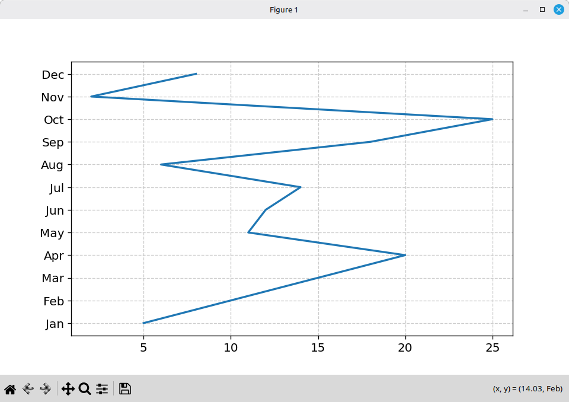
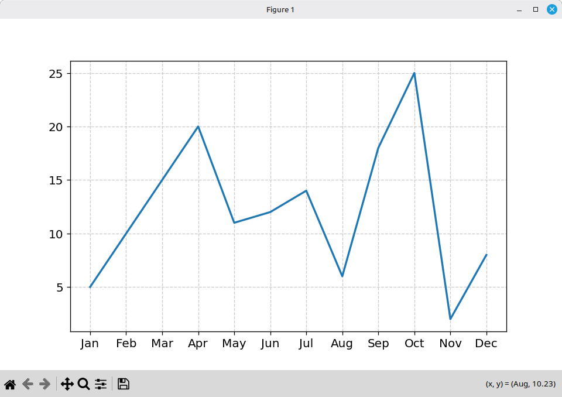

# Matplotlib

**CREATED:**: *Sat 20 Jun 2026 03:02 PM GMT*  
**UPDATED:**: *Sat 20 Jun 2026 03:02 PM GMT* 

-----

## Introduction

Speaking as a 'beginner'...I find Matplotlib fairly straight forwards, and, simple to use...;    
one uses it to plot many different styles of graphs, including:  

- straight line     
- bar chart    
- scatter plot    
- etc.  

-----

In this particular example...the code starts off by  
importing the matplotlib library: import matplotlib  
and, calling one of it's related methods: pyplot  
and, also, using a short form alias: plt      
-(in this way, we don't need to keep typing in the long form: matplotlib.pyplot;     
  and, can just type in short form prefix: plt)-    

> import matplotlib.pyplot as plt  

-----

The next part of the code sets up co-ordinates representing both the (x,y) chart axis:          

> x = [5,10,15,20,11,12,14,6,18,25,2,8]  
> y = ["Jan","Feb","Mar","Apr","May","Jun","Jul","Aug","Sep","Oct","Nov","Dec"]    

What this means is the horizontal x axis will display the numbers going across left to right;    
and, the vertical y axis will display the months going upwards from bottom to top.  

-----

The next step is to plot the chart using:   

> plt.plot(x,y)  

...only, the chart itself will NOT show. To do that you need to add the following line...    

> plt.show()  

...and, that's it code done.  

-----

## SCREENSHOTS

### OUTPUT: Straight line Graph01A

To run the program inside of Linux Mint OS Terminal application command window, type:    

> python graph01A.py  

...and, a window will open up displaying the chart as follows.  

  

-----

### OUTPUT: Straight line Graph01B

To run the program inside of Linux Mint OS Terminal application command window, type:    

> python graph01B.py  

...and, a window will open up displaying the chart as follows.  

  

**NOTE**: All I did in the second version of this graph was to switch variable names:   
          x to say y/y to say x;  
          which, in turn, changed the graph output orientation.  

-----

**FOOTNOTES**

It is still pretty much amazing to me...that with just merely 5 lines of code...;  
one is able to use Matplotlib...to output fine 'quality' graphs.  

The output graph itself...contains further options where one can 'save' the file onto one's own hard disk drive/-etc.  

          
