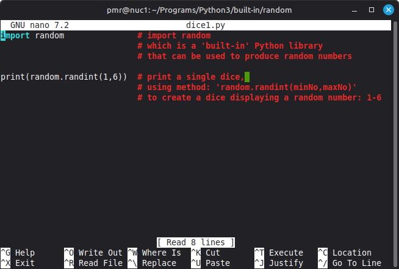
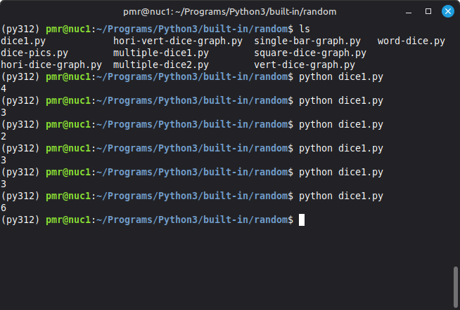

# PROGRAM: [Dice.py]  

**COMPUTER**: Home based, Nuc MiniPC box      
**OPERATING SYSTEM**: Linux Mint OS, Version 22.3  
**PROGRAMMING LANGUAGE**: Python3, Version: 3.12.3  
**EDITOR**: GNU Nano 7.2  

**AUTHOR**: Mr. Paul Ramnora  
**LOCATION**: London, UK  
**EMAIL**: paulramnoracoder@yahoo.com  

**CREATED**: *Fri 19th June 2026 15:00 PM GMT*  
**UPDATED**: *Fri 19th June 2026 15:00 PM GMT*  

-----

## Explanation  

A simple dice throw program.  

-----

The program, first, imports the library called: random.

> import random  

Random, is a Python 'built-in' library which allows one to do things like:   
- produce random numbers  
- make random choices  
- etc.  

-----

Next, it uses a random method called: randint() to output the simulation of a dice throw: 

## CODE SYNTAX  

random.randint(minNo,maxNo).  

-----

## ACTUAL CODE  

> import random  
> print(random.randint(1,6))  

-----

**NOTE(S)**:  

This program is particularly *short*...consisting of just merely 2 lines of code.    

-----

## SCREENSHOT PICTURES  

### PROGRAM: Source code  

  

### PROGRAM: Output  

  
