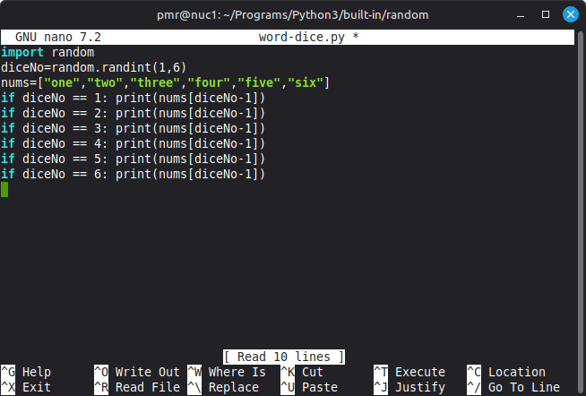
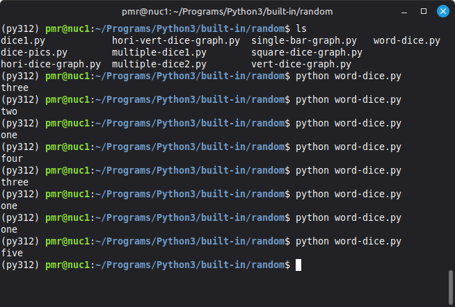

# PROGRAM: [word-dice.py]  

**COMPUTER**: Home based, Nuc MiniPC box      
**OPERATING SYSTEM**: Linux Mint OS, Version 22.3  
**PROGRAMMING LANGUAGE**: Python3, Version: 3.12.3  
**EDITOR**: GNU Nano 7.2  

**AUTHOR**: Mr. Paul Ramnora  
**LOCATION**: London, UK  
**EMAIL**: paulramnoracoder@yahoo.com  

**CREATED**: *Fri 19th June 2026 19:37 PM GMT*  
**UPDATED**: *Fri 19th June 2026 19:37 PM GMT*  

-----

## Explanation  

A simple dice throw program...;  
which prints out the 'dice number' as being a 'word number' instead of an actual number.   

-----

The program, first, imports the library called: random.

> import random  

Random, is a Python 'built-in' library which allows one to do things like:   
- produce random numbers  
- make random choices  
- etc.  

-----

Next, it uses a random method called: randint() to output the simulation of a dice throw: 

## CODE SYNTAX  

random.randint(minNo,maxNo).  

A simple dice throw program.  

-----

## ACTUAL CODE  

> import random  
> print(random.randint(1,6))  

-----

Afterwards, the program used a series of 6 x if then statements...;  
each of which is used to select which number word is to be printed out...;        
corresponding with whichever dice number was thrown.  

## ACTUAL CODE  

> if diceNo == 1: print(nums[diceNo-1])  
> if diceNo == 2: print(nums[diceNo-1])  
> if diceNo == 3: print(nums[diceNo-1])  
> if diceNo == 4: print(nums[diceNo-1])  
> if diceNo == 5: print(nums[diceNo-1])  
> if diceNo == 6: print(nums[diceNo-1]  

So, if a 1 was thrown...; the word 'one' would be printed out;  
and, if a 2 was thrown...; then, the word 'two' would be printed out;  
and, so on.  

**NOTE(S)**:  

This program is the same as [dice.py]; only the output is being shown in the form of words/as opposed to numbers.    

It would be possible to re-write the 6 x if selection lines to be more 'compact' by changing these into being a loop, instead.  

> for eachLoopNo in range(1,6+1):  
>     if eachLoopNo == diceNo: print nums[diceNo-1])  

...then, the code would be just 4 lines long, instead.  

-----

## SCREENSHOT PICTURES  

### PROGRAM: Source code  

  

### PROGRAM: Output  

  
